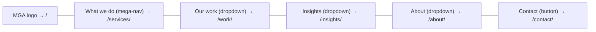
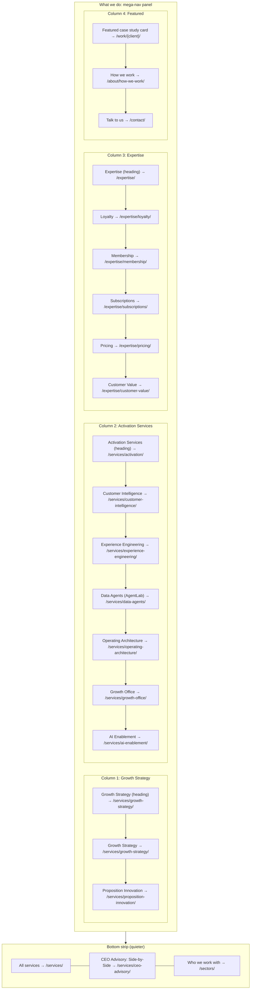
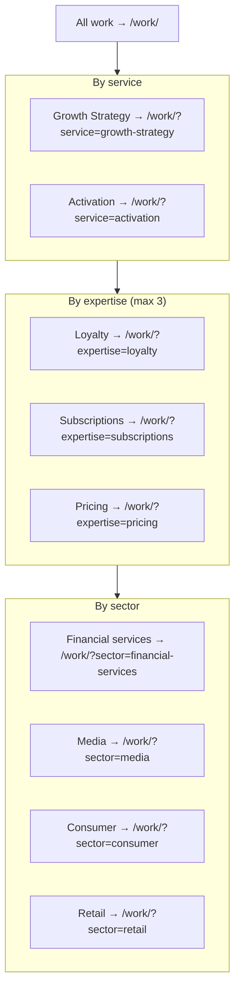
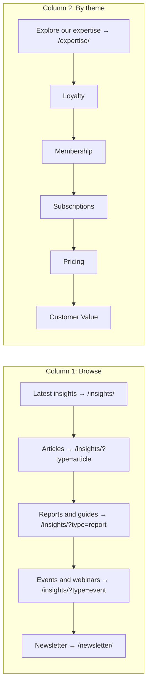
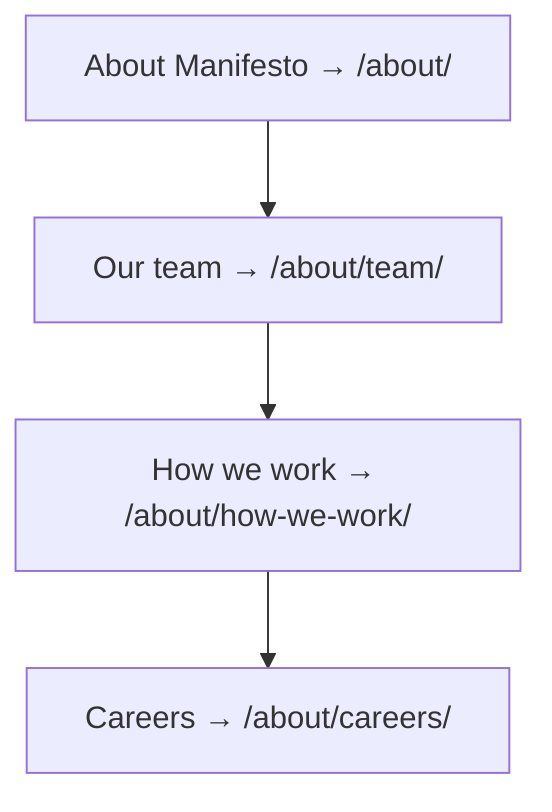
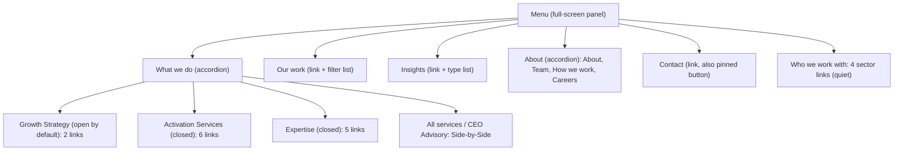

# Diagram: header and What we do mega-nav

Mermaid source. Renders in GitHub, GitLab and most markdown previewers. The authoritative description is `../01-primary-navigation.md`; if the two disagree, the document wins.

## Header

## What we do mega-nav

## Our work dropdown

## Insights dropdown

## About dropdown

## Mobile menu (collapsed header)

