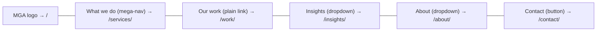
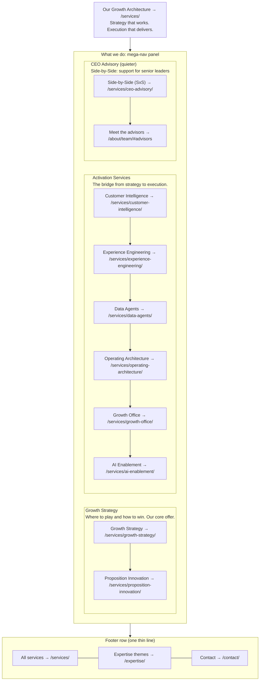
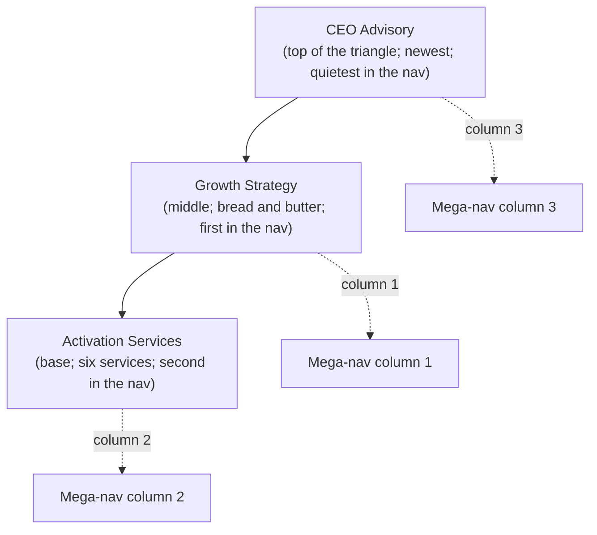
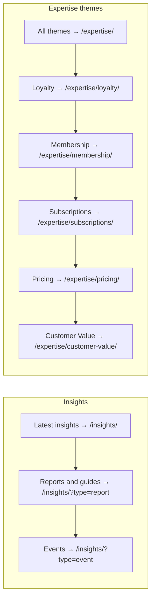
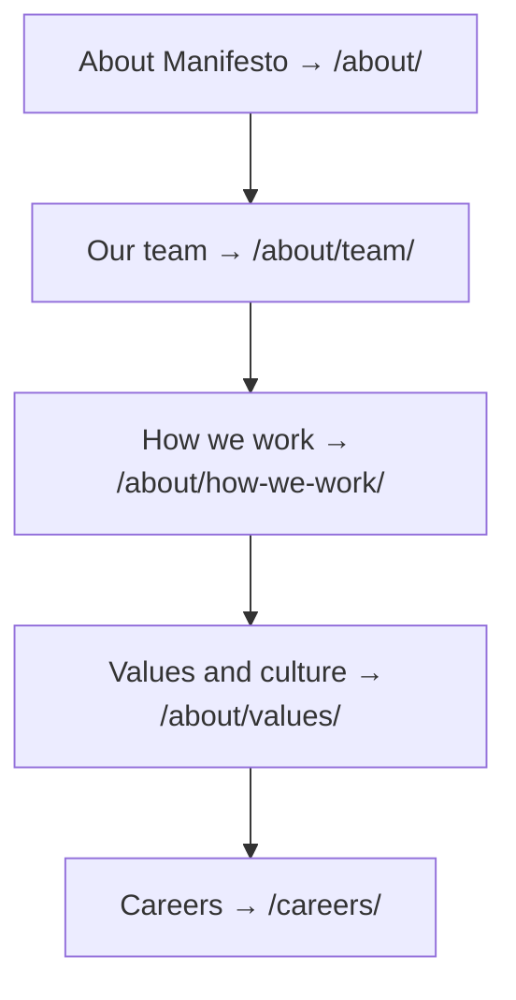
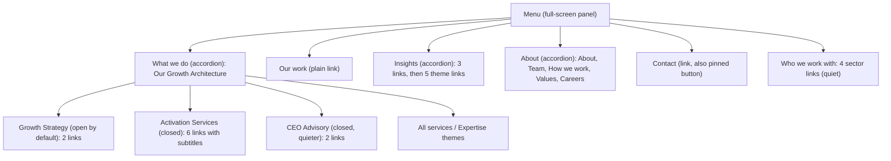
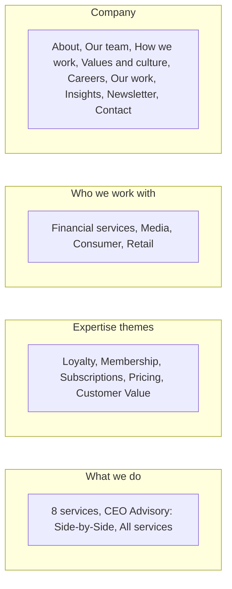

# Diagram: header and What we do mega-nav (v2)

Mermaid source. Renders in GitHub, GitLab and most markdown previewers. The authoritative description is `../01-primary-navigation.md`; if the two disagree, the document wins.

## Header

## What we do mega-nav: the triangle, three columns

Column headings link to the pillar pages: Growth Strategy → `/services/growth-strategy/`, Activation Services → `/services/activation/`, CEO Advisory → `/services/ceo-advisory/`.

## The triangle as Andy draws it (Source B) and how it maps to the nav

## Insights dropdown

## About dropdown

## Mobile menu (collapsed header)

## Footer

