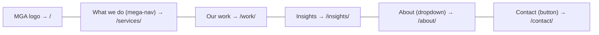
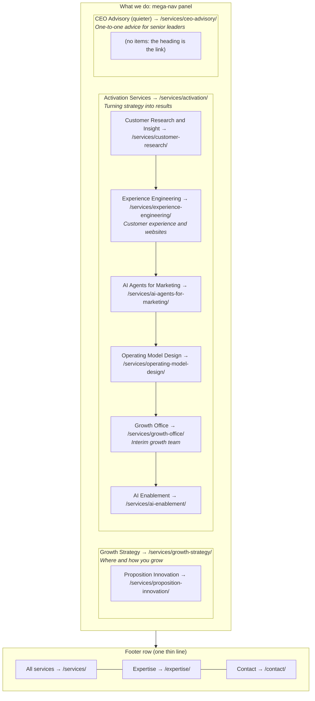
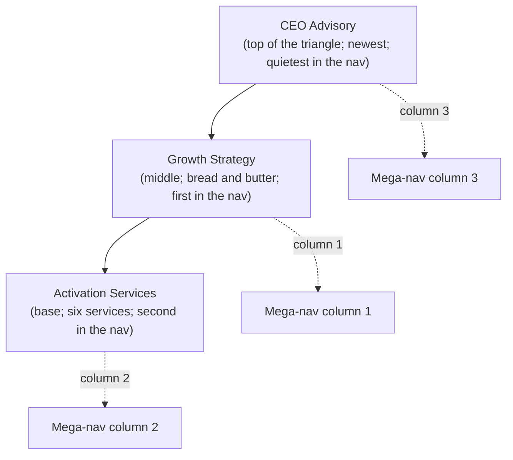
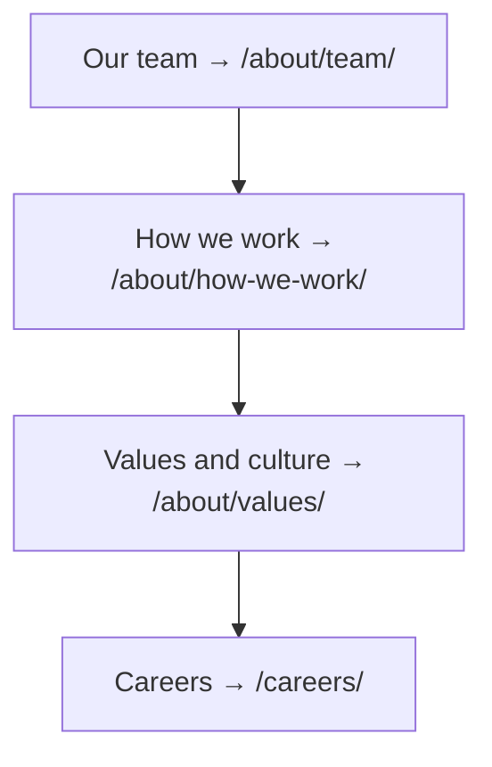
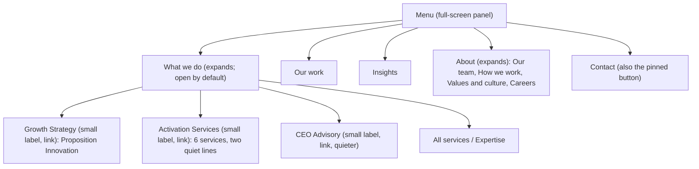
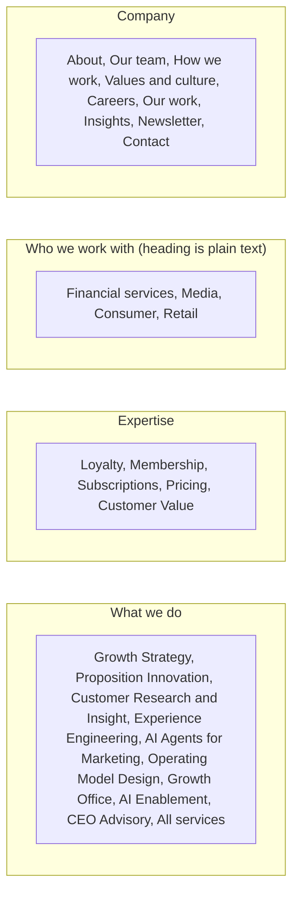

# Diagram: header and What we do mega-nav (v4)

Mermaid source. Renders in GitHub, GitLab and most markdown previewers. The authoritative description is `../01-primary-navigation.md`; if the two disagree, the document wins.

## Header

One mega-nav, one small dropdown. Our work and Insights are plain links.

## What we do mega-nav: the triangle, three columns, labels only

Column headings are the pillar links. Italic lines under the headings are the three pillar lines; the two italic lines under Experience Engineering and Growth Office are the only item-level text in the panel. There is no heading line above the columns. 13 links, 12 destinations, about 45 words. See `../v4-simplification.md` for what was removed from v3.

## The triangle as Andy draws it (Source B) and how it maps to the nav

## About dropdown

Clicking About itself goes to `/about/`.

## Mobile menu (collapsed header)

Two levels deep. No pillar sub-accordions and no sectors block; sectors are in the page footer.

## Footer

