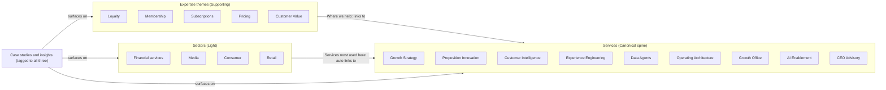
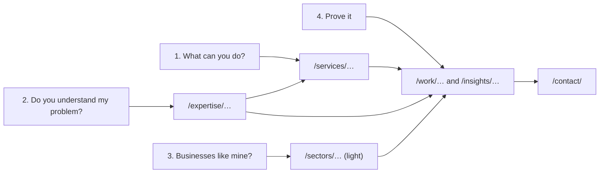

# Diagram: sitemap

Mermaid source. The authoritative list is `../02-sitemap.md`; if the two disagree, the document wins.

Legend for node styling: Canonical pages are bold-bordered, Supporting pages normal, Light pages dashed, Utility pages grey.

## Full sitemap tree

```mermaid
flowchart TB
    classDef canonical stroke-width:3px
    classDef supporting stroke-width:1px
    classDef light stroke-dasharray: 5 5
    classDef utility fill:#eeeeee,stroke:#999999,color:#555555

    Home["/ Home"]:::canonical

    %% Services
    Home --> S["/services/ Service hub"]:::canonical
    S --> S1["/services/growth-strategy/"]:::canonical
    S --> S2["/services/proposition-innovation/"]:::canonical
    S --> SA["/services/activation/ Group"]:::supporting
    SA --> S3["/services/customer-intelligence/"]:::canonical
    SA --> S4["/services/experience-engineering/"]:::canonical
    SA --> S5["/services/data-agents/"]:::canonical
    SA --> S6["/services/operating-architecture/"]:::canonical
    SA --> S7["/services/growth-office/"]:::canonical
    SA --> S8["/services/ai-enablement/"]:::canonical
    S --> S9["/services/ceo-advisory/ (downweighted)"]:::supporting

    %% Expertise
    Home --> E["/expertise/ Hub"]:::supporting
    E --> E1["/expertise/loyalty/"]:::supporting
    E --> E2["/expertise/membership/"]:::supporting
    E --> E3["/expertise/subscriptions/"]:::supporting
    E --> E4["/expertise/pricing/"]:::supporting
    E --> E5["/expertise/customer-value/"]:::supporting

    %% Sectors
    Home --> Sec["/sectors/ Index"]:::light
    Sec --> Sec1["/sectors/financial-services/"]:::light
    Sec --> Sec2["/sectors/media/"]:::light
    Sec --> Sec3["/sectors/consumer/"]:::light
    Sec --> Sec4["/sectors/retail/"]:::light

    %% Work
    Home --> W["/work/ Hub, filterable"]:::canonical
    W --> W1["/work/{client}/ Case study (n)"]:::supporting
    W --> Wf["/work/?service= ?expertise= ?sector= (noindex)"]:::utility

    %% Insights
    Home --> I["/insights/ Hub, filterable"]:::supporting
    I --> I1["/insights/{slug}/ Article, report, event (n)"]:::supporting
    I --> If["/insights/?type= ?expertise= (noindex)"]:::utility
    Home --> N["/newsletter/"]:::utility

    %% About
    Home --> A["/about/"]:::supporting
    A --> A1["/about/team/"]:::supporting
    A1 --> A1a["/about/team/{name}/ Profile (n)"]:::light
    A --> A2["/about/how-we-work/ Methodology"]:::supporting
    A --> A3["/about/careers/"]:::light

    %% Contact
    Home --> C["/contact/"]:::utility
    C --> C1["/contact/thank-you/ (noindex)"]:::utility

    %% Utility
    Home --> U["Legal: /privacy-policy/ /cookie-policy/ /terms/ /accessibility/"]:::utility
    Home --> U2["/search/ /404/ /sitemap.xml /robots.txt"]:::utility
```

Note: the Activation group node is shown as a parent of six services for readability. The six service URLs are flat under `/services/` (see decision D-03 in `../06-decisions-log.md`).

## The three dimensions and how they intersect

Reading the diagram: content flows one way. Themes and sectors point into services. Proof (case studies and insights) is tagged with services, themes and sectors and appears automatically on all three. Services never point "down" into a theme-specific or sector-specific copy of themselves, because none exist.

## Visitor journey the IA is built around

